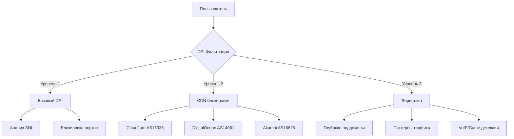

# 🛡️ 3x-ui DPI Bypass - Обход блокировок в РФ

Комплексное решение для настройки сервера 3x-ui (VLESS+Reality) для обхода Deep Packet Inspection (DPI) и блокировок провайдеров в Российской Федерации.

**Актуальность:** 24 октября 2025 (добавлена WARP обфускация)
**Основано на:** [GitHub Issue #5704](https://github.com/Flowseal/zapret-discord-youtube/issues/5704) + Cloudflare WARP

[](https://www.linux.org/)
[](https://github.com/XTLS/Xray-core)
[](LICENSE)

---

## 📖 Оглавление

- [О проекте](#-о-проекте)
- [Проблема](#-проблема)
- [Решение](#-решение)
- [Быстрый старт](#-быстрый-старт)
- [Документация](#-документация)
- [Уровни настройки](#-уровни-настройки)
- [Возможности](#-возможности)
- [Требования](#-требования)
- [Поддерживаемые сервисы](#-поддерживаемые-сервисы)
- [FAQ](#-faq)
- [Вклад в проект](#-вклад-в-проект)
- [Лицензия](#-лицензия)

---

## 🎯 О проекте

Этот репозиторий содержит набор bash-скриптов для автоматической настройки сервера 3x-ui с целью обхода блокировок интернет-провайдеров в России.

### Что делает проект?

- ✅ Автоматически настраивает фрагментацию пакетов (packet fragmentation)
- ✅ Оптимизирует TCP соединения для обхода DPI
- ✅ Создает специальные правила маршрутизации для заблокированных сервисов
- ✅ **НОВОЕ:** Интеграция Cloudflare WARP для максимальной обфускации (когда zapret не работает)
- ✅ Делает автоматические бэкапы перед каждым изменением
- ✅ Предоставляет детальное логирование и тестирование
- ✅ Позволяет откатить изменения в любой момент

### Для кого этот проект?

- 🔧 Администраторы серверов VPN
- 👨‍💻 Разработчики, настраивающие 3x-ui
- 🌐 Пользователи, желающие обойти блокировки Discord, YouTube и других сервисов
- 🛡️ Люди, ценящие приватность и свободный доступ к информации

---

## 🚨 Проблема

### Хронология блокировок в 2025 году

| Дата | Событие |
|------|---------|
| **1 апреля 2025** | Первая волна ужесточения DPI-фильтрации |
| **9 июня 2025** | Массовое падение работы Zapret и VPN-сервисов |
| **20-21 октября 2025** | Блокировка Cloudflare, OVH, Hetzner, DigitalOcean |
| **23 октября 2025** | Zapret перестал работать для большинства пользователей |
| **24 октября 2025** | ✅ Добавлено решение: WARP обфускация для обхода блокировок |

### Три уровня блокировок



**Результат:** Без специальной настройки VPN-сервер блокируется провайдерами в течение нескольких часов.

---

## 💡 Решение

Этот проект предлагает **трехуровневую систему настройки**, которая последовательно обходит все типы блокировок:

### Архитектура решения

```
┌─────────────────────────────────────────────────────────┐
│                    Level 1: Basic DPI                   │
│  • Fragment пакетов (100-200 байт)                      │
│  • TCP Fast Open                                        │
│  • Базовая маршрутизация (80, 443)                      │
└─────────────────────────────────────────────────────────┘
                            ↓
┌─────────────────────────────────────────────────────────┐
│                   Level 2: CDN Bypass                   │
│  • Cloudflare домены + IP-сеты                          │
│  • Специальные порты (2053, 2083, 2087, 2096, 8443)     │
│  • Discord UDP порты (19294-19344)                      │
└─────────────────────────────────────────────────────────┘
                            ↓
┌─────────────────────────────────────────────────────────┐
│                 Level 3: Advanced Mode                  │
│  • Хардкорный режим (весь трафик)                       │
│  • Игровые порты (50000-50100)                          │
│  • TLS fingerprint рандомизация                         │
└─────────────────────────────────────────────────────────┘
```

---

## 🚀 Быстрый старт

### Установка одной командой

```bash
# Подключитесь к серверу
ssh root@your-server-ip

# Запустите скрипт (зависимости установятся автоматически!)
cd /root && \
git clone https://github.com/alche-my/x-ui-settings-update.git && \
cd x-ui-settings-update/x-ui-tuning && \
./level-1-basic-dpi.sh
```

**Вот и всё!** Скрипт автоматически:
- ✅ Установит необходимые зависимости (jq, curl, dnsutils)
- ✅ Создаст бэкап конфигурации
- ✅ Применит Level 1 настройки
- ✅ Перезапустит x-ui
- ✅ Протестирует подключение

### Проверка результата

После применения скрипта откройте на вашем клиенте:
- ✅ https://discord.com
- ✅ https://youtube.com
- ✅ https://google.com

**Важно:** Ваш VLESS-ключ не меняется! Используйте существующее подключение.

### ⚠️ Если zapret не работает

Если традиционные методы (Level 1/2) не помогают или **zapret перестал работать**, используйте WARP обфускацию:

```bash
cd x-ui-settings-update/x-ui-tuning
./warp-obfuscation.sh
```

WARP обеспечивает максимальную обфускацию через Cloudflare WARP network и работает когда другие методы заблокированы.

---

## 📚 Документация

### Основные файлы документации

| Файл | Описание |
|------|----------|
| 📄 [x-ui-tuning/README.md](x-ui-tuning/README.md) | Полная техническая документация |
| ⚡ [x-ui-tuning/QUICKSTART.md](x-ui-tuning/QUICKSTART.md) | Быстрый старт за 5 минут |

### Детальные руководства

В [полной документации](x-ui-tuning/README.md) вы найдете:

- 🔍 Подробное описание каждого уровня конфигурации
- 🧪 Инструкции по тестированию
- 🔄 Процедуры отката изменений
- 🛠️ Troubleshooting и решение проблем
- 📈 Варианты масштабирования на несколько серверов
- 🔗 Ссылки на источники и дополнительные материалы

---

## 🎚️ Уровни настройки

### Level 1: Basic DPI Bypass ✅ (Готово)

**Статус:** Production-ready
**Время применения:** ~30 секунд

**Что делает:**
- Фрагментация TLS Client Hello (100-200 байт, интервал 10-20 мс)
- TCP Fast Open для уменьшения latency
- Keep-Alive оптимизация (30 секунд)
- Routing правила для HTTP/HTTPS

**Что работает после Level 1:**
- ✅ Discord (текст)
- ✅ Google, поисковики
- ⚠️ YouTube (страницы открываются, видео могут грузиться медленно)

**Применение:**
```bash
cd x-ui-tuning
./level-1-basic-dpi.sh
```

---

### Level 2: CDN Bypass ✅ (Готово)

**Статус:** Production-ready
**Время применения:** ~40 секунд
**Основано на:** Стратегия из Issue #5704 для Cloudflare proxy

**Что делает:**
- **Включает все настройки Level 1** (кумулятивная архитектура)
- CDN-оптимизированная фрагментация (50-150 байт, интервал 5-15 мс - более агрессивно!)
- Специальные порты Cloudflare: 2053, 2083, 2087, 2096, 8443
- Роутинг ~30 Cloudflare доменов через CDN-оптимизированный outbound
- Discord voice channels оптимизация (UDP 19294-19344)
- YouTube video streaming оптимизация

**Что работает после Level 2:**
- ✅ Discord voice каналы (стабильная голосовая связь)
- ✅ YouTube видео (быстрая загрузка HD/4K)
- ✅ CDN-сервисы через Cloudflare
- ✅ Все сервисы из Level 1 (улучшенные)

**Применение:**
```bash
cd x-ui-tuning
./level-2-cdn-bypass.sh

# Просмотр изменений перед применением
./level-2-cdn-bypass.sh --dry-run
```

**Важно:** Level 2 **кумулятивен** - он включает все настройки Level 1 + дополнительные оптимизации для CDN. Для возврата к Level 1: откатитесь к бэкапу ДО Level 2, затем запустите `level-1-basic-dpi.sh`.

---

### WARP Obfuscation ✅ (Когда zapret не работает)

**Статус:** Production-ready
**Время применения:** ~60 секунд
**Используйте когда:** zapret и другие методы перестали работать

**Что делает:**
- Использует Cloudflare WARP для обфускации трафика
- WireGuard протокол для максимальной безопасности
- Маршрутизация через WARP network Cloudflare
- Обход DPI, который блокирует традиционные VPN протоколы

**Что работает после WARP Obfuscation:**
- ✅ Discord (текст + голос) - стабильная работа
- ✅ YouTube (видео) - быстрая загрузка
- ✅ Google сервисы - полная функциональность
- ✅ Все заблокированные сервисы через WARP
- ⚠️ Может добавить небольшую задержку (50-100ms)

**Применение:**
```bash
cd x-ui-tuning
./warp-obfuscation.sh

# Просмотр изменений перед применением
./warp-obfuscation.sh --dry-run
```

**Важно:**
- Требует wireguard-tools (устанавливается автоматически)
- Трафик идет через Cloudflare WARP network
- Максимальная обфускация против DPI
- Используйте когда Level 1/2 не помогают или zapret не работает

---

### Level 3: Advanced Mode 🔮 (Запланировано)

**Статус:** Концепт
**Для:** Сложных случаев блокировок

**Что добавит:**
- Хардкорный режим (обработка всего трафика без whitelist)
- Игровые порты (50000-50100)
- TLS fingerprint рандомизация
- Обход эвристики для глубоких поддоменов (4+ уровней)

**Применение:** Только если Level 2 и WARP недостаточно

---

## ✨ Возможности

### 🔒 Безопасность

- ✅ **Автоматические бэкапы** - перед каждым изменением
- ✅ **Валидация конфигурации** - проверка JSON перед применением
- ✅ **Атомарное применение** - изменения применяются целиком или не применяются вовсе
- ✅ **Простой откат** - один скрипт для восстановления

### 📊 Логирование

- ✅ **Цветной вывод** - зеленый (успех), красный (ошибка), желтый (предупреждение)
- ✅ **Файловые логи** - `/var/log/x-ui-tuning/`
- ✅ **Детализация изменений** - каждый параметр логируется
- ✅ **Timing информация** - замер времени для каждого теста

### 🧪 Тестирование

- ✅ **Автоматические тесты** - проверка доступности сервисов
- ✅ **DNS тесты** - проверка резолвинга доменов
- ✅ **TCP тесты** - проверка портов
- ✅ **HTTP тесты** - проверка веб-доступа

### 🛡️ Надежность

- ✅ **Preflight checks** - проверка окружения перед запуском
- ✅ **Dependency validation** - проверка установленных пакетов
- ✅ **Disk space check** - проверка свободного места
- ✅ **Service status check** - проверка x-ui сервиса

### ⚙️ Гибкость

- ✅ **Dry-run режим** - предпросмотр изменений без применения
- ✅ **Verbose режим** - детальный debug вывод
- ✅ **Skip-tests опция** - быстрое применение без тестов
- ✅ **Модульная архитектура** - легко добавлять новые уровни

---

## ⚙️ Требования

### Системные требования

| Компонент | Требование |
|-----------|------------|
| **ОС** | Linux (Ubuntu 20.04+, Debian 10+) |
| **Права** | root или sudo |
| **Диск** | Минимум 100 MB свободно |
| **3x-ui** | Установлен и запущен |
| **Протокол** | VLESS+Reality |

### Зависимости

**Устанавливаются автоматически!** ✨

Скрипт самостоятельно проверит и установит необходимые пакеты:
- `jq` - работа с JSON конфигурациями
- `curl` - HTTP тесты
- `dig` (dnsutils) - DNS тесты
- `nc` (netcat) - TCP тесты

**Не нужно ничего устанавливать вручную** - просто запустите скрипт!

<details>
<summary>Ручная установка (если автоматическая не сработала)</summary>

```bash
apt-get update && apt-get install -y jq curl dnsutils netcat-openbsd
```
</details>

---

## 🌐 Поддерживаемые сервисы

### После Level 1

| Сервис | Статус | Комментарий |
|--------|--------|-------------|
| Google | ✅ Работает | Полностью функционален |
| Discord (текст) | ✅ Работает | Сообщения, каналы |
| Discord (voice) | ⚠️ Частично | Может быть нестабильно |
| YouTube (сайт) | ✅ Работает | Страницы открываются |
| YouTube (видео) | ⚠️ Медленно | Буферизация, нужен Level 2 |
| GitHub | ✅ Работает | Git operations работают |
| Wikipedia | ✅ Работает | Без проблем |

### После Level 2

| Сервис | Статус | Комментарий |
|--------|--------|-------------|
| Discord voice | ✅ Работает | Стабильная голосовая связь |
| YouTube видео | ✅ Работает | Быстрая загрузка HD/4K |
| Cloudflare CDN | ✅ Работает | Оптимизированные порты + домены |
| Cloudflare DNS | ✅ Работает | 1.1.1.1 доступен |
| Google Meet | ✅ Работает | Видеоконференции |
| Все из Level 1 | ✅ Улучшено | Более стабильная работа |

### После WARP Obfuscation (когда zapret не работает)

| Сервис | Статус | Комментарий |
|--------|--------|-------------|
| Discord (текст + голос) | ✅ Работает | Стабильная работа через WARP |
| YouTube видео | ✅ Работает | Быстрая загрузка через WARP |
| Google сервисы | ✅ Работает | Полная функциональность |
| Twitter / X | ✅ Работает | Обход блокировок |
| Facebook | ✅ Работает | Обход блокировок |
| OpenAI / ChatGPT | ✅ Работает | Доступ через WARP |
| Cloudflare сервисы | ✅ Работает | Нативная интеграция |
| Все заблокированные | ✅ Работает | Максимальная обфускация |
| Latency | ⚠️ +50-100ms | Небольшая задержка через WARP |

**Примечание:** WARP — это решение для случаев когда традиционные методы (Level 1/2) или zapret перестали работать. Обеспечивает максимальную обфускацию.

### После Level 3 (планируется)

| Сервис | Ожидаемый статус |
|--------|------------------|
| League of Legends | ✅ Работает |
| Другие игры | ✅ Работает |
| Все CDN | ✅ Максимальная совместимость |

---

## 💬 FAQ

### Безопасно ли использовать эти скрипты?

✅ **Да.** Скрипты:
- Создают бэкап перед каждым изменением
- Валидируют конфигурацию перед применением
- Не меняют клиентские настройки
- Можно откатить в любой момент
- Open source - код доступен для проверки

### Нужно ли менять настройки на клиенте?

❌ **Нет.** Изменения применяются только на сервере. Ваш VLESS-ключ остается прежним.

### Что если скрипт сломает мой сервер?

🔄 **Откат за 10 секунд:**
```bash
./rollback.sh /root/3x-ui-backups/config-<timestamp>.json
```

Каждый запуск создает бэкап, который можно восстановить.

### Будет ли работать с другими протоколами (не VLESS)?

⚠️ Скрипты оптимизированы для VLESS+Reality. Для других протоколов могут потребоваться корректировки.

### Работает ли на других Linux дистрибутивах?

✅ Да, но тестировалось на:
- Ubuntu 20.04, 22.04
- Debian 10, 11

Для других дистрибутивов может потребоваться адаптация команд установки зависимостей.

### Что делать если Level 1 не помог?

1. Попробуйте Level 2: `./level-2-cdn-bypass.sh`
2. Если Level 2 не помог или zapret не работает: `./warp-obfuscation.sh`
3. Проверьте логи: `journalctl -u x-ui -n 50`
4. Запустите тесты: `./test-suite.sh`
5. Откатите изменения: `./rollback.sh <backup-file>`
6. Создайте Issue с подробным описанием и логами

### Когда использовать WARP обфускацию?

✅ **Используйте WARP когда:**
- zapret перестал работать
- Level 1 и Level 2 не помогают
- Провайдер блокирует традиционные VPN протоколы
- Нужна максимальная обфускация трафика
- Блокируются Cloudflare, Discord, YouTube даже с Level 2

⚠️ **Учтите:**
- WARP добавляет небольшую задержку (50-100ms)
- Трафик идет через Cloudflare WARP network
- Требует wireguard-tools (устанавливается автоматически)

### Можно ли использовать для нескольких серверов?

✅ Да! Смотрите раздел [Масштабирование](x-ui-tuning/README.md#масштабирование) в документации.

### Законно ли это использовать?

⚖️ **Disclaimer:** Использование VPN и обход блокировок может нарушать законы вашей страны. Автор не несет ответственности за использование. Проект предоставлен для образовательных целей.

---

## 📁 Структура проекта

```
x-ui-settings-update/
├── README.md                           # Этот файл
└── x-ui-tuning/                        # Основная директория скриптов
    ├── README.md                       # Техническая документация
    ├── QUICKSTART.md                   # Быстрый старт
    ├── common-functions.sh             # Общие функции
    ├── level-1-basic-dpi.sh           # Level 1 скрипт ✅
    ├── level-2-cdn-bypass.sh          # Level 2 скрипт ✅
    ├── warp-obfuscation.sh            # WARP обфускация ✅ (когда zapret не работает)
    ├── level-3-advanced.sh            # Level 3 (запланировано)
    ├── rollback.sh                     # Скрипт отката
    ├── test-suite.sh                   # Автоматические тесты
    └── configs/                        # Конфигурационные файлы
        ├── cloudflare-domains.txt      # Cloudflare домены
        ├── level-2-cdn-ips.txt        # IP-адреса CDN (планируется)
        └── level-3-domains.txt        # Дополнительные домены (планируется)
```

---

## 🤝 Вклад в проект

Мы приветствуем вклад в развитие проекта!

### Как помочь?

1. 🐛 **Сообщайте о багах** - создавайте Issues с описанием проблемы
2. 💡 **Предлагайте улучшения** - новые идеи всегда приветствуются
3. 📝 **Улучшайте документацию** - опечатки, уточнения, переводы
4. 🧪 **Тестируйте** - разные провайдеры, регионы, конфигурации
5. 💻 **Пишите код** - новые фичи, оптимизации

### Процесс контрибуции

```bash
# 1. Fork репозитория
# 2. Создайте ветку для вашей фичи
git checkout -b feature/amazing-feature

# 3. Коммитьте изменения
git commit -m 'Add amazing feature'

# 4. Push в ветку
git push origin feature/amazing-feature

# 5. Откройте Pull Request
```

### Что мы ищем?

- 🔍 Тестирование на разных провайдерах (МТС, Билайн, Мегафон, Ростелеком, etc.)
- 📊 Метрики производительности (latency, throughput)
- 🌍 Результаты из разных регионов РФ
- 🛠️ Улучшения для Level 2 и Level 3
- 📚 Улучшения документации

---

## 📚 Источники и благодарности

Этот проект основан на исследованиях и обсуждениях сообщества:

### Основные источники

- 📌 [GitHub Issue #5704](https://github.com/Flowseal/zapret-discord-youtube/issues/5704) - Актуальные стратегии обхода (23 октября 2025)
- 💬 [ntc.party обсуждение](https://ntc.party/t/17013/173) - Детали блокировки CDN
- 📦 [V3nilla/IPSets-For-Bypass-in-Russia](https://github.com/V3nilla/IPSets-For-Bypass-in-Russia) - IP-адреса для маршрутизации
- 🧪 [DPI Checker](https://hyperion-cs.github.io/dpi-checkers/ru/tcp-16-20/) - Тест DPI фильтрации

### Связанные проекты

- [Flowseal/zapret-discord-youtube](https://github.com/Flowseal/zapret-discord-youtube)
- [ankddev/zapret-discord-youtube](https://github.com/ankddev/zapret-discord-youtube)
- [XTLS/Xray-core](https://github.com/XTLS/Xray-core)
- [3x-ui](https://github.com/MHSanaei/3x-ui)

**Спасибо всем контрибьюторам и исследователям за их работу!** 🙏

---

## 📞 Поддержка

### Есть вопросы?

- 💬 **Issues** - создайте Issue в этом репозитории
- 📖 **Документация** - читайте [полную документацию](x-ui-tuning/README.md)
- 🐛 **Баги** - опишите проблему с логами и шагами воспроизведения

### Перед созданием Issue

Пожалуйста, проверьте:

1. ✅ Установлены ли все зависимости?
2. ✅ Запущен ли x-ui сервис?
3. ✅ Есть ли root права?
4. ✅ Достаточно ли места на диске?
5. ✅ Прочитали ли вы [Troubleshooting](x-ui-tuning/README.md#troubleshooting)?

### Формат Issue

```markdown
## Описание проблемы
[Краткое описание]

## Шаги воспроизведения
1. Запустил команду X
2. Получил ошибку Y

## Окружение
- ОС: Ubuntu 22.04
- Провайдер: Ростелеком
- Регион: Москва
- x-ui версия: X.X.X

## Логи
[Вставьте логи]
```

---

## ⚖️ Лицензия

Этот проект распространяется под лицензией MIT.

```
MIT License

Copyright (c) 2025 x-ui-settings-update contributors

Permission is hereby granted, free of charge, to any person obtaining a copy
of this software and associated documentation files (the "Software"), to deal
in the Software without restriction, including without limitation the rights
to use, copy, modify, merge, publish, distribute, sublicense, and/or sell
copies of the Software, and to permit persons to whom the Software is
furnished to do so, subject to the following conditions:

The above copyright notice and this permission notice shall be included in all
copies or substantial portions of the Software.

THE SOFTWARE IS PROVIDED "AS IS", WITHOUT WARRANTY OF ANY KIND, EXPRESS OR
IMPLIED, INCLUDING BUT NOT LIMITED TO THE WARRANTIES OF MERCHANTABILITY,
FITNESS FOR A PARTICULAR PURPOSE AND NONINFRINGEMENT. IN NO EVENT SHALL THE
AUTHORS OR COPYRIGHT HOLDERS BE LIABLE FOR ANY CLAIM, DAMAGES OR OTHER
LIABILITY, WHETHER IN AN ACTION OF CONTRACT, TORT OR OTHERWISE, ARISING FROM,
OUT OF OR IN CONNECTION WITH THE SOFTWARE OR THE USE OR OTHER DEALINGS IN THE
SOFTWARE.
```

### Disclaimer

⚠️ **Важное предупреждение:**

Этот проект предоставлен **"как есть"** для **образовательных целей**.

- Использование VPN и обход блокировок может нарушать законы вашей страны
- Автор не несет ответственности за использование этого ПО
- Вы используете скрипты на свой страх и риск
- Проект не поощряет нарушение законодательства

Пользователь несет полную ответственность за использование данного ПО в соответствии с законами своей юрисдикции.

---

## 🌟 Статус проекта

**Текущая версия:** 1.2
**Статус:** Active Development

### Roadmap

- [x] Level 1: Basic DPI Bypass (✅ Готово)
- [x] Level 2: CDN Bypass (✅ Готово)
- [x] WARP Obfuscation (✅ Готово - для случаев когда zapret не работает)
- [ ] Level 3: Advanced Mode (📋 Запланировано)
- [ ] Web-интерфейс для управления (💡 Идея)
- [ ] Ansible playbooks (💡 Идея)
- [ ] Docker контейнер (💡 Идея)
- [ ] Мониторинг и алерты (💡 Идея)

### Changelog

#### v1.2 (24 октября 2025)

**Добавлено:**
- ✅ WARP Obfuscation - альтернативный метод когда zapret не работает
- ✅ Интеграция Cloudflare WARP через WireGuard протокол
- ✅ Автоматическая установка wireguard-tools
- ✅ Маршрутизация через WARP для максимальной обфускации
- ✅ Обход DPI блокирующего традиционные VPN

**Важно:**
- 🔒 Используйте WARP когда Level 1/2 не помогают или zapret заблокирован
- 🌐 Трафик идет через Cloudflare WARP network для максимальной приватности

#### v1.1 (24 октября 2025)

**Добавлено:**
- ✅ Level 2: CDN Bypass - кумулятивная архитектура
- ✅ Cloudflare специальные порты (2053, 2083, 2087, 2096, 8443)
- ✅ Роутинг ~30 Cloudflare доменов
- ✅ Discord UDP оптимизация (19294-19344)
- ✅ CDN-оптимизированная фрагментация (50-150 байт, 5-15ms)
- ✅ YouTube video streaming оптимизация

**Улучшено:**
- 🔧 Все Level 1 настройки работают более стабильно с Level 2

#### v1.0 (23 октября 2025)

**Добавлено:**
- ✅ Level 1: Basic DPI Bypass
- ✅ Автоматические бэкапы
- ✅ Система логирования
- ✅ Тестовый набор
- ✅ Механизм отката
- ✅ Полная документация на русском

---

## 💖 Поддержать проект

Если этот проект помог вам:

- ⭐ Поставьте звезду этому репозиторию
- 🔀 Сделайте Fork и улучшите код
- 📢 Расскажите друзьям
- 🐛 Сообщите о багах
- 💡 Предложите улучшения

**Каждый вклад важен!** 🙏

---

<div align="center">

### 🚀 Готовы начать?

**[📖 Читайте документацию](x-ui-tuning/README.md)** • **[⚡ Быстрый старт](x-ui-tuning/QUICKSTART.md)** • **[💬 Создать Issue](../../issues)**

---

**Сделано с ❤️ для свободного интернета**

Последнее обновление: 24 октября 2025

</div>
